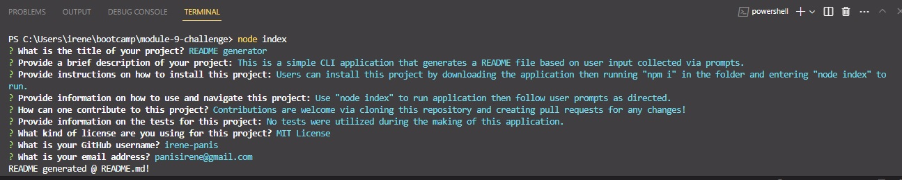

# README Generator

## Description

This is a simple CLI application that generates a README file based on user input collected via prompts.

## Usage/Preview

Users are able to run this application by typing "node index" in their terminal and following the user prompts as directed. The user inputs will then be placed in a README file complete with formatting and a functional table of contents.

[Demo video here](https://youtu.be/eoPb3zHilQk)

## Technologies Used
* Node.js

## Credits

N/A

## License

N/A